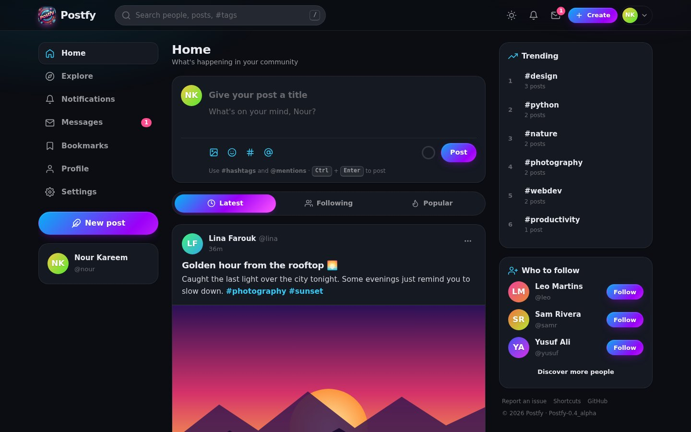
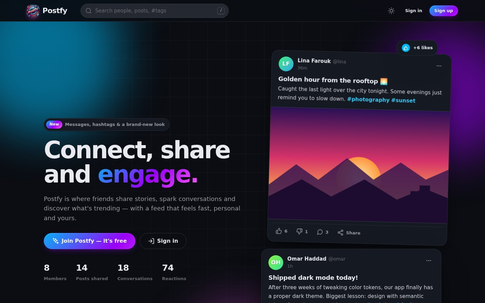
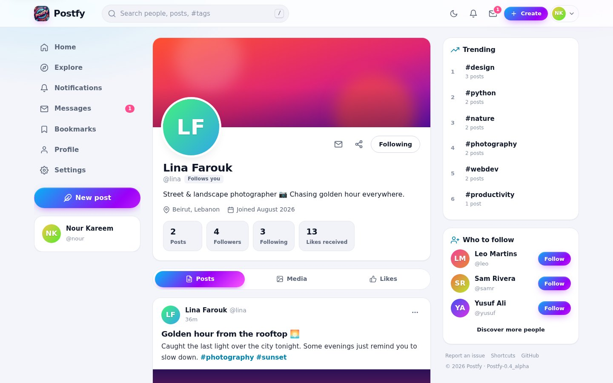
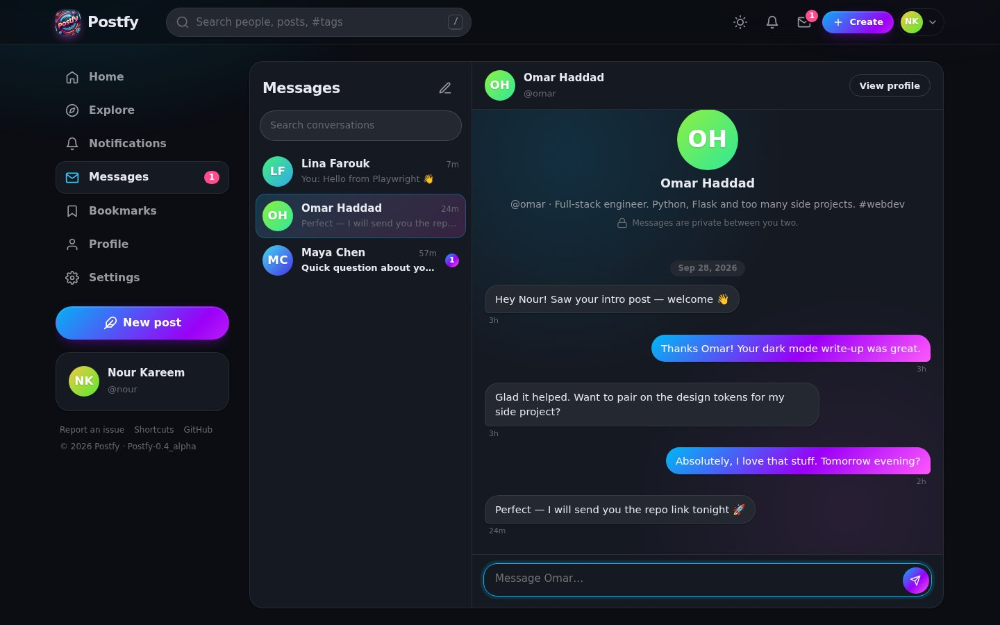
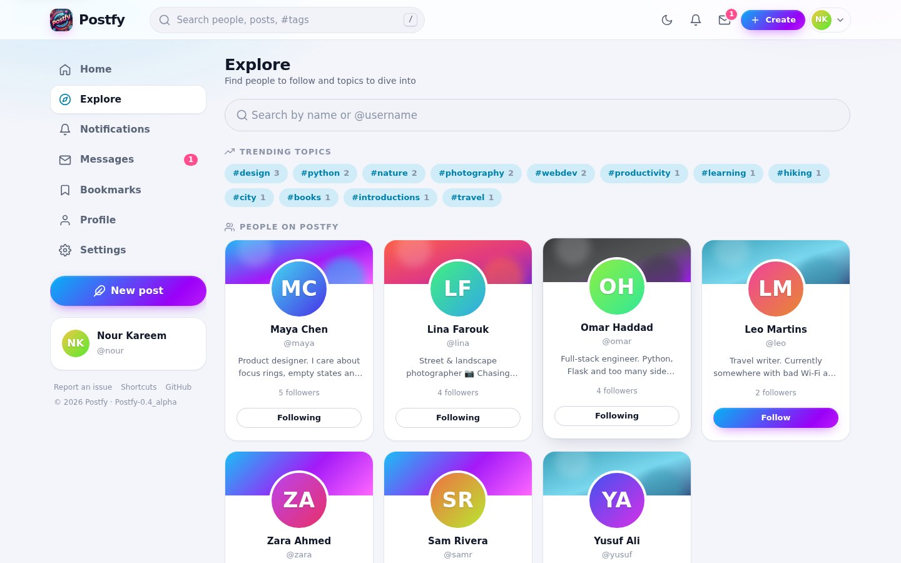

# Postfy

Postfy is a modern social media web application built with Flask. Share posts with photos, #hashtags and
@mentions, follow people, chat privately, and get notified when your friends engage — all wrapped in a fast,
neon-themed interface with light, dark and system themes.

### ▶️ [Try the live demo](https://hussan20.github.io/postfy/)

> The live demo runs entirely in your browser on GitHub Pages — sign in with any details and you'll be
> exploring as **Nour**. Likes, comments, follows, posts and messages all work, but nothing is saved.
> To run the full app with a real database, see [Run it locally](#run-it-locally).



<table>
  <tr>
    <td></td>
    <td></td>
  </tr>
  <tr>
    <td></td>
    <td></td>
  </tr>
</table>

## Features

**Posting & conversation**
- Rich posts with a title, photo upload (drag & drop or paste), emoji picker, #hashtags, @mentions and clickable links
- Inline composer with a live character ring, auto-growing text box and automatic draft saving
- Comments that post, edit and delete instantly — no page reloads
- Like / dislike with animated counters, double-tap a photo to like it, full-screen photo viewer
- Bookmarks to save posts for later, share or copy a link to any post, report posts to moderators
- Edited-post indicator, "Show more" for long posts, relative timestamps ("5m", "2h") with the full date on hover

**People & discovery**
- Profiles with cover image, bio, location, website, join date and stats (posts, followers, following, likes received)
- Follow / unfollow, followers & following lists, "Follows you" badge and "Who to follow" suggestions
- Feed tabs: **Latest**, **Following** and **Popular** (ranked by engagement and recency) with infinite scroll
- Trending hashtags, hashtag pages, and search across people, posts and tags with live suggestions as you type
- Explore page to discover people

**Messages & notifications**
- Private one-to-one messages with live updates, read receipts ("Seen") and unread counters
- Notifications for likes, comments, follows and mentions, with live badges in the navigation
- "New posts" pill when others post while you're reading

**Make it yours**
- Light, dark or system theme, five accent colors, three text sizes and a reduce-motion option
- Settings for profile, account, password, data export (JSON) and account deletion
- Onboarding checklist for new members

**Quality**
- Responsive layout with a mobile bottom navigation bar; right-to-left support for Arabic text
- Keyboard shortcuts (press <kbd>?</kbd> in the app), visible focus states, skip link, ARIA labels
- CSRF protection on every form, escaped user content, validated image uploads, safe redirects
- Works without JavaScript — every button is a real link or form, JavaScript just makes it instant
- Existing databases are upgraded automatically on start-up; nothing is lost
- Admin panel (users, posts, reports, theme colors) at `/admin`

## Run it locally

1. Clone the repository and enter it:
   ```bash
   git clone https://github.com/hussan20/postfy.git
   cd postfy
   ```

2. Create a virtual environment (recommended) and install the dependencies:
   ```bash
   python -m venv venv
   # Windows
   venv\Scripts\activate
   # macOS / Linux
   source venv/bin/activate

   pip install -r requirements.txt
   ```

3. Start the app:
   ```bash
   flask --app app run --debug
   ```
   Open <http://127.0.0.1:5000/>. The database (`instance/users.db`) is created — or upgraded, if you already
   have one — automatically.

4. *(Optional)* Fill it with demo people, posts and conversations:
   ```bash
   flask --app app seed-demo
   ```
   Then sign in as **demo@postfy.dev** / **postfy123**.

5. *(Optional)* Create an admin account and visit <http://127.0.0.1:5000/admin>:
   ```bash
   flask --app app create-admin
   ```

Set the `SECRET_KEY` environment variable to a long random value before deploying anywhere public, and
`DATABASE_URL` if you want to use a different database file.

## Tests

```bash
python -m unittest discover tests
```

The suite uses a temporary database and upload folders, so it never touches your real data.

## The live demo (GitHub Pages)

GitHub Pages can only host static files, so `tools/build_static.py` runs the real app against a temporary
database filled with demo content, renders every page and writes them out as HTML. In the browser,
`static/js/app.js` sees the demo flag and answers requests itself, so the site stays interactive.

The workflow in `.github/workflows/pages.yml` runs the tests and rebuilds the demo on every push to `main`.
**One-time setup:** in the repository go to **Settings → Pages → Build and deployment** and set
**Source** to **GitHub Actions**. The site will then be live at `https://<owner>.github.io/<repo>/`.

Preview the static build on your own machine with:
```bash
python tools/build_static.py --serve
```
Add `--relative` to build a copy with relative links that works from any folder or static host.


## Keyboard shortcuts

| Keys | Action |
| --- | --- |
| <kbd>/</kbd> | Search |
| <kbd>N</kbd> | New post |
| <kbd>J</kbd> / <kbd>K</kbd> | Next / previous post |
| <kbd>L</kbd> · <kbd>C</kbd> · <kbd>B</kbd> · <kbd>O</kbd> | Like · comment · save · open the focused post |
| <kbd>G</kbd> then <kbd>H</kbd> / <kbd>E</kbd> / <kbd>N</kbd> / <kbd>M</kbd> / <kbd>P</kbd> / <kbd>B</kbd> / <kbd>S</kbd> | Go to Home / Explore / Notifications / Messages / Profile / Bookmarks / Settings |
| <kbd>T</kbd> | Toggle dark / light |
| <kbd>Ctrl</kbd> + <kbd>Enter</kbd> | Publish a post or comment |
| <kbd>?</kbd> | Show all shortcuts |

## Technology Stack

- **Backend**: Python with Flask
- **Database**: SQLite with SQLAlchemy ORM (Flask-Migrate available for migrations)
- **Frontend**: Jinja2 templates, hand-written CSS design system, vanilla JavaScript (no build step)
- **Icons**: inline SVG sprite (`static/icons.svg`)
- **Hosting for the demo**: GitHub Pages via GitHub Actions

## Project Structure

```
postfy/
├── app.py                  # Flask app: models, routes, JSON APIs, schema upgrade
├── admin.py                # Admin panel blueprint (/admin)
├── demo_data.py            # Demo content (`flask --app app seed-demo`)
├── requirements.txt
├── Templates/
│   ├── base.html           # App shell: top bar, sidebars, mobile nav, dialogs, toasts
│   ├── _macros.html        # Shared UI pieces: post card, comments, avatars, icons…
│   ├── partials/           # Composer, sidebar, fragments returned to JavaScript
│   ├── home.html           # Landing page
│   ├── newpost.html        # Home feed
│   ├── profile.html        # Profiles
│   ├── messages.html       # Direct messages
│   ├── settings.html       # Settings
│   ├── …                   # Search, tags, notifications, bookmarks, auth, errors
│   └── admin/              # Admin panel templates
├── static/
│   ├── css/styles.css      # Design system (themes, components, layout)
│   ├── js/app.js           # Interactions, live updates, shortcuts, demo mode
│   ├── icons.svg           # Icon sprite
│   ├── images/             # Logo & app icons
│   └── profile_pics/       # Uploaded profile photos
├── tests/test_app.py       # Test suite
├── tools/build_static.py   # Builds the GitHub Pages demo
├── docs/screenshots/       # README images
└── migrations/             # Database migration files
```

## Database Models

- **User** — profile, username, bio, location, website, cover and profile photos
- **Post** — title, content, optional photo, edit time
- **Comment**, **Reaction** (like / dislike), **Bookmark**
- **Follow** — who follows whom
- **Notification** — likes, comments, follows and mentions
- **Message** — private messages with read state
- **Report** — issues and reported posts for moderators

## Contributing

1. Fork the repository
2. Create your feature branch: `git checkout -b feature/amazing-feature`
3. Commit your changes: `git commit -m 'Add some amazing feature'`
4. Push to the branch: `git push origin feature/amazing-feature`
5. Open a Pull Request

## License

This project is licensed under the MIT License - see the LICENSE file for details.

## Acknowledgements

- Flask and its extensions
- SQLAlchemy
- Feather icons (MIT) for the icon set
- The open-source community for inspiration and resources

---

## Team

Developed with ❤️ by:
- Hassan (backend)
- Hussain (backend)
- aymen (security)
- Laila (frontend)
- Sara (frontend)
- Maria (database)
- Teba(database)
