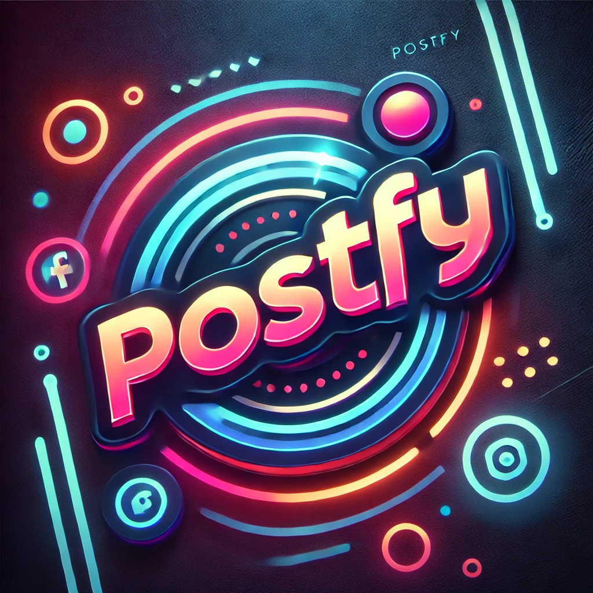

# Postfy

Postfy is a modern social media web application built with Flask, allowing users to create accounts, share posts, and interact with other users. The application features a sleek neon-themed UI with dark/light mode support.



## Features

- **User Authentication**: Secure signup and login functionality
- **Profile Management**: Customizable user profiles with profile pictures
- **Post Creation & Management**: Create, edit, and delete posts
- **Dark/Light Mode Toggle**: Personalized viewing experience
- **Responsive Design**: Optimized for various screen sizes

## Technology Stack

- **Backend**: Python with Flask framework
- **Database**: SQLite with SQLAlchemy ORM
- **Frontend**: HTML, CSS, JavaScript
- **Templating**: Jinja2
- **File Storage**: Local file system for profile pictures

## Installation

1. Clone the repository:
   ```
   git clone https://github.com/your-username/postfy.git
   cd postfy
   ```

2. Set up a virtual environment (recommended):
   ```
   python -m venv venv
   
   # On Windows
   venv\Scripts\activate
   
   # On macOS/Linux
   source venv/bin/activate
   ```

3. Install dependencies:
   ```
   pip install -r requirements.txt
   ```

4. Create the necessary directories:
   ```
   mkdir -p static/profile_pics
   ```

5. Initialize the database:
   ```
   flask db init
   flask db migrate -m "Initial migration"
   flask db upgrade
   ```

6. Run the application:
   ```
   flask run
   ```

7. Open your browser and navigate to `http://127.0.0.1:5000/`

## Project Structure

```
postfy/
├── app.py                 # Main Flask application file
├── static/                # Static files (CSS, JavaScript, images)
│   ├── css/               # CSS stylesheets
│   │   └── styles.css     # Main stylesheet
│   ├── images/            # Image assets
│   └── profile_pics/      # User profile pictures
├── templates/             # HTML templates
│   ├── base.html          # Base template with navbar and theme toggle
│   ├── home.html          # Landing page
│   ├── login.html         # Login page
│   ├── signup.html        # Signup page
│   ├── profile.html       # User profile page
│   ├── newpost.html       # Posts listing page
│   ├── create_post.html   # Create post form
│   └── edit_post.html     # Edit post form
├── migrations/            # Database migration files
└── README.md              # Project documentation
```

## Database Model

The application uses two main models:

1. **User**: Stores user information including profile pictures
2. **Post**: Stores post content with relationships to users

## Key Implementation Details

### Post Editing & Deletion
- Only the author of a post can edit or delete it
- Confirmation prompt before deletion
- Secure route handling with ownership verification

### Profile Picture Implementation
- Support for various image formats (PNG, JPG, JPEG, GIF)
- Secure filename handling
- Default avatar fallback using UI Avatars API

### Theme Toggle
- Client-side theme preference stored in localStorage
- CSS variables for consistent theming across the application
- Seamless switching without page reload

## Future Enhancements

- Comments on posts
- Like/reaction system
- Friend/follow functionality
- User profile editing
- Enhanced notification system
- Responsive design improvements

## Contributing

1. Fork the repository
2. Create your feature branch: `git checkout -b feature/amazing-feature`
3. Commit your changes: `git commit -m 'Add some amazing feature'`
4. Push to the branch: `git push origin feature/amazing-feature`
5. Open a Pull Request

## License

This project is licensed under the MIT License - see the LICENSE file for details.

## Acknowledgements

- Flask and its extensions
- SQLAlchemy
- UI Avatars for default profile pictures
- The open-source community for inspiration and resources

---

## Team

Developed with ❤️ by:
- Hassan
- Hussain
- Laila
- Sara
- Maria
- Teba
